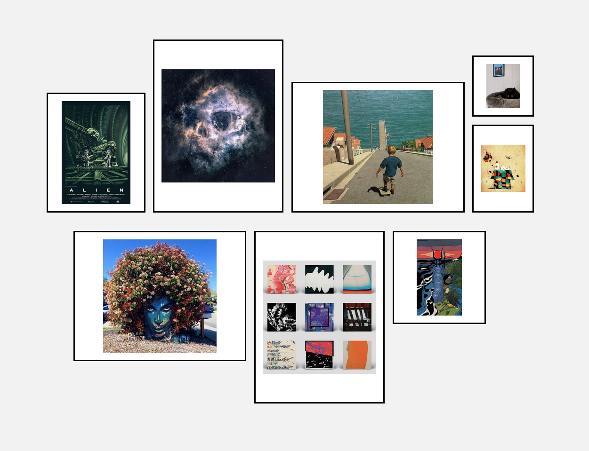

# Photo Framer

This is a simple app that allows you to upload some images and it will display them in various layouts.

It's available online at [photoframer.netlify.app](https://photoframer.netlify.app/)

# Purpose and details

I made this relatively simple app to be able to play around with different photo wall layouts. While decorating my home I ran into the problem of having to figure out how to best lay out some of my photos for the living room wall, so it seemed like a good opportunity to try out some techniques. Here's the basic info:

- App is built with React on Vite
- Photos are uploaded only to application state, they never leave the user's machine, and are not persisted anywhere
- Each layout is a separate CSS file where the frames are defined. If you fork this and want to add your own, just add another numbered `.css` file in `src/layouts`.

# Things learned / experimented with

- This was useful to learn some Vite features, like the [Glob import](https://vite.dev/guide/features#glob-import)
- Figuring out the cleanest way to define the specific layouts was interesting. I landed on CSS Grid, and it was the right call, as they are really easy to knock out quickly (the other option was absolute positioning with percentages).

# To Do

- Add ability to re-order the photos. This is the #1 feature missing here to make it useful
- Add a color picker for the "wall" background
- Add ability to disable the passepartout (the white "padding") inside the frames and have the photos fill up the whole frame
- Some other QoL additions, like a header, footer link back to github, etc...
- Add more layouts
